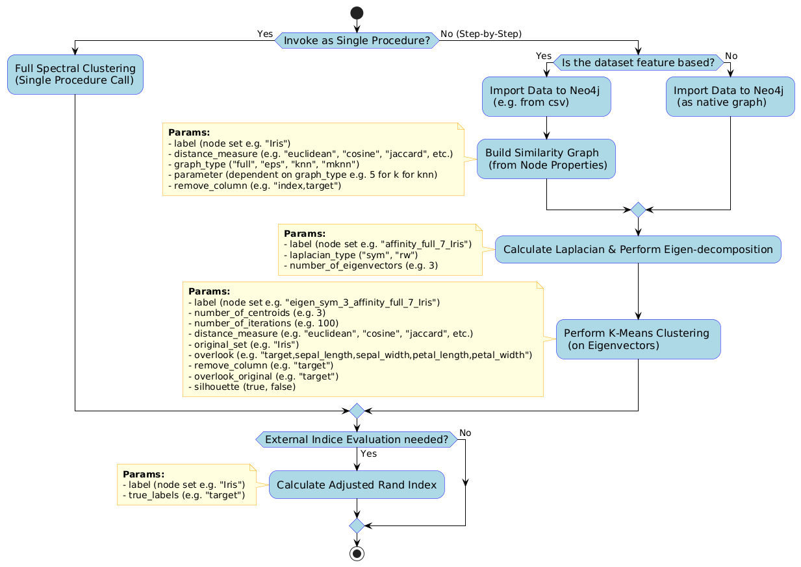

# SimKit
Plug-in for Neo4j containing user-defined procedures to perform Spectral Clustering through a single procedure or as individual procedures (Similarity Graph, Laplacian Eigendecomposed Graph, KMeans). Additional procedures available for evaluation with Average Silhouette Score and Adjusted Rand Index, visualization of matrices into String and saving them to CSV.




## [About](https://github.com/Graphistics/simkit/wiki)


## Procedure Stack

### Init SimKit
```java
return simkit.initSimKit('bolt://localhost:7687', 'neo4j', '123412345')
```

### Create Graph From Nodes
```java
return simkit.nodePropertyToGraph({
    label: "Iris",
    distance_measure: "euclidean",
    graph_type: "full",
    parameter: 7,
    remove_column: "index,target"
})
```

### Create EigenGraph
```java
return simkit.nodePropertyEigen({
    label: "affinity_full_7_Iris",
    laplacian_type: "sym",
    number_of_eigenvectors: 3
})
```

### Kmean Clustering
```java
return simkit.kMeans({
    label: "eigen_sym_3_affinity_full_7_Iris",
    number_of_centroids: 3,
    number_of_iterations: 100,
    distance_measure: "euclidean",
    original_set: "Iris",
    overlook: "target,sepal_length,sepal_width,petal_length,petal_width",
    overlook_original: "target",
    silhouette: false
})
```

### Calculate Adjusted rand index
```java
return simkit.adjustedRandIndex({
    label: "Iris",
    true_labels: "target"
})
```

### Spectral Clustering
```java
return simkit.spectralClustering({
    label: "Iris",
    is_feature_based: true,
    distance_measure: "euclidean",
    graph_type: "full",
    parameter: 7,
    remove_columns: "index,target",
    laplacian_type: "sym",
    number_of_eigenvectors: 3,
    number_of_iterations: 100,
    distance_measure_kmean: "euclidean",
    target_column: "target",
    silhouette: false,
    seed: 42
})
```

### Visualize Matrix and save as CSV
```java
return simkit.getMatrix("affinity_full_7_Iris","adjacency","/path/to/folder")
```


## Changelog
- Renamed main. to simkit.
- added initSimkit as initialisation function to remove hardcoded login creds
- Changed test Cases to enable compilation on all devices


